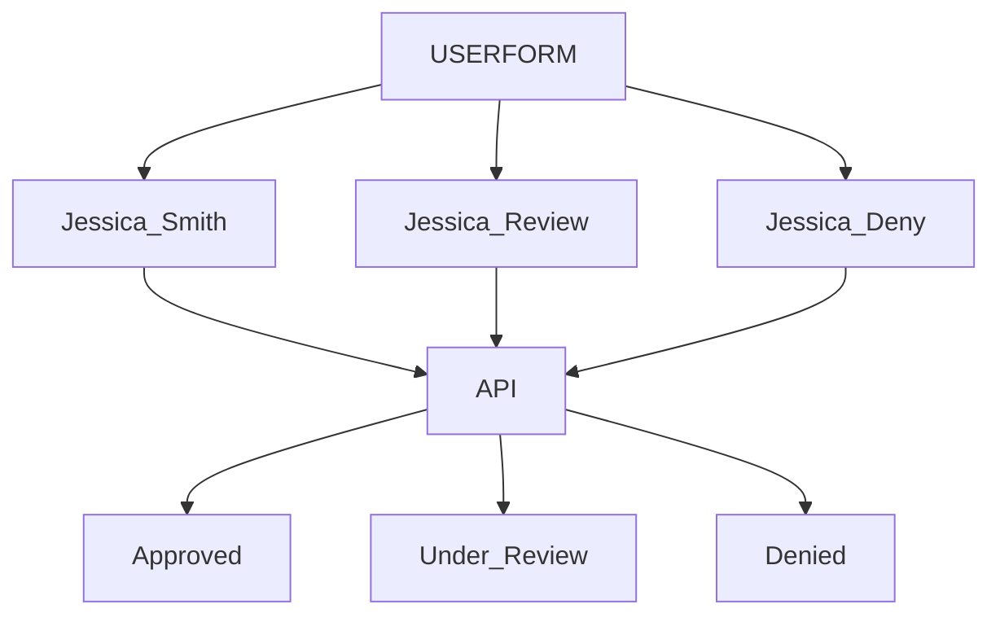

<h1 align="center">
  Technical Assessment for Luke Seto<br>
</h1>

**About this Project**

💳 Credit Card Signup with Fraud Evaluation<br>
A simple web application that allows users to sign up for a credit card through a secure form. Once submitted, the user data is sent to a fraud evaluation API (Alloy) to determine approval status.


**Getting Started**

1. Add your Basic authentication token to the Python file
   ```sh
   Example - "authorization": "Basic xxx"
   ```
2. Run the python file and open the webpage

 <br><br>

3. After the user fills out the Sign Up form, the information will be passed to Alloy API for fraud evaluation<br><br>

**Use Case**


4. Depending on the Summary Outcome, a pop-up will display showing their status

<p align="center">
  
</p>

**Languages Used**
<br>
```sh
- Python
- HTML/CSS/JavaScript
```
**Packages Used**
```sh
  - Flask 
  - Requests
```
**API Reference**
<br>
```sh
https://developer.alloy.com/public/reference/post_evaluations
```  
